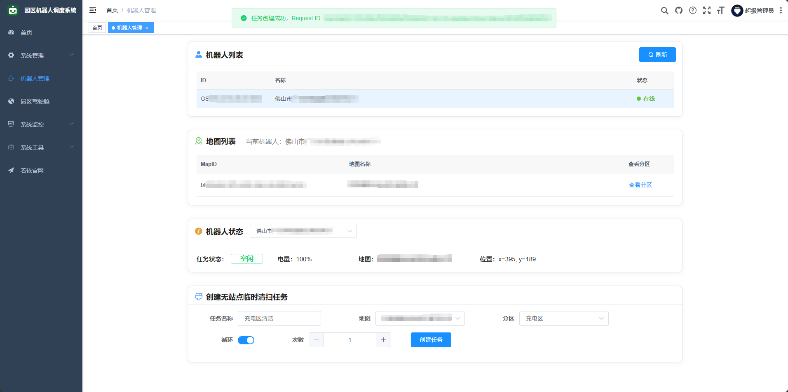
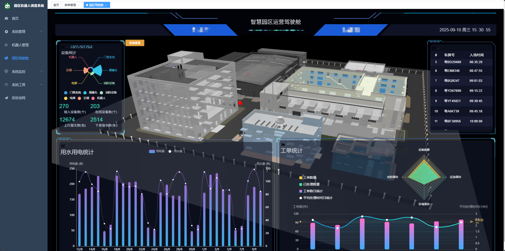
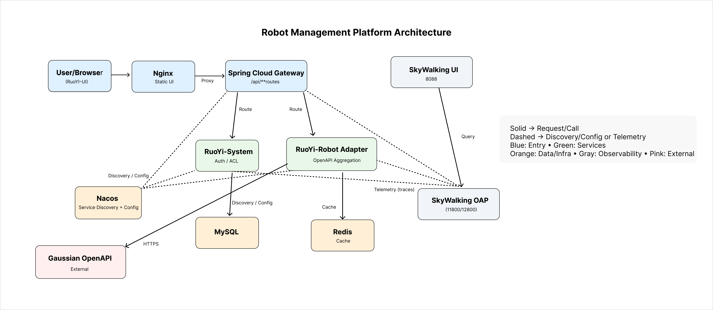

<h1 align="center" style="margin: 30px 0 30px; font-weight: bold;">
  园区机器人调度系统 · 代码结构演示（RuoYi-Cloud v3.6.6）
</h1>
<h4 align="center">
  面向多厂商（高仙 / Gaussian Robotics、宇树等）的机器人接入、编排与调度平台（只读示例仓库，默认不可运行）
</h4>
<p align="center">
  <a href="https://gitee.com/y_project/RuoYi-Cloud">
    
  </a>
  
  
  
  
  <a href="LICENSE"></a>
</p>

> **What**：多厂商机器人接入、编排与调度的平台**代码结构与设计示例**。  
> **Why**：避免误触发真实设备与泄露敏感信息，本仓库**默认不可运行**。  
> **Who**：面向后端/架构/平台治理读者（网关治理、稳定性与可观测性）。

## 📌 重要声明（务必先读）
- 本仓库为**代码结构与设计演示**，**默认不可运行**。  
- **未包含 Nacos 配置**、任何密钥/凭据与可用的外部地址；所有第三方参数均已移除或以占位符存在。  
- 原因：项目对接真实机器人/生产环境，公开可运行版本可能**误触发真实设备**或泄露隐私，因此默认禁用实际调用。  
- 运行效果已在 **百度网盘 / Slides** 展示（见下文），用于说明功能与界面，不依赖本仓库直接连外网。

---

## 📚 目录
- 📌 重要声明（必读）
- 🧾 项目简介（含技术栈）
- 🎬 效果展示（驾驶舱 & 后台截图）
- 📈 服务等级目标（SLO）
- 📂 模块与阅读路线
- 🏗️ 架构设计（运行时视图）
- 🗃️ 目录结构（示例）
- 🧩 关键方案：RabbitMQ 异步化 & 抗洪峰
- 📘 使用须知（合规·不可运行·私有演示·FAQ·License）
- 👤 Author

---

## 🧾 项目简介
本项目基于 **RuoYi-Cloud v3.6.6** 二次开发，目标是打造一个**多厂商机器人集成调度系统**：统一接入不同厂商 OpenAPI（以**高仙（Gaussian Robotics）**为例），提供任务编排、地图/分区管理、状态监控与可观测性。  
为确保安全与合规，当前仓库以**示例代码结构**为主，聚焦工程拆分、网关与业务层设计、限流/降级与可观测性接入方式。

---

## 主要能力（示例代码侧重）

- **多厂商适配层**：封装第三方 OpenAPI（以高仙为例），抽象设备/指令与状态模型，屏蔽协议/字段差异。  
- **任务编排与异步受理**：临时/循环任务的受理改为 **202 Accepted + taskId**，状态稳定查询；失败进入 **DLQ** 便于回溯。  
- **资产与运行视图**：设备列表与在线状态、地图/分区清单，任务进度与异常联动（Demo 数据）。  
- **网关治理**：统一路由聚合，**限流/熔断/降级**，黑白名单与基础鉴权挂点；读写分流的返回策略示例。  
- **可观测性闭环**：全链路 **TraceId 贯通**（Gateway → Service → MQ → 厂商 OpenAPI），日志↔链路互查。  
- **配置与灰度**：Nacos 作为服务发现与配置中心，按环境下发开关/阈值，支持规则热更新。  
- **安全与合规**：公开仓库仅保留接口/DTO/骨架，**不包含**可运行地址与任何密钥，避免误连真实设备。  
- **代码组织与可读性**：API/Service/Adapter 分层清晰，接口契约与命名统一，便于替换厂商或扩展能力。

---

## 技术栈（结构演示）

- **后端框架**
  - Java 17 · **Spring Boot**
  - **Spring Cloud Alibaba**：Gateway（路由/治理）、OpenFeign（服务间调用）
  - 校验与序列化：Spring Validation、Jackson（按需）

- **中间件与数据**
  - **RabbitMQ**：Topic→Queue→DLQ；手动 ack、幂等键（`X-Request-Id`）
  - **Redis**：任务状态与幂等缓存（TTL），热点数据缓存
  - **MySQL**：基础配置/业务表（示例不附带可用连接）
  - **Nacos**：服务发现与配置下发

- **可观测性**
  - **SkyWalking**：OAP + UI；服务上报 Trace，日志携带 TraceId 做关联检索
  - 统一日志：Logback（示例埋点）

- **前端与交付**
  - **ruoyi-ui（Vue 2.x）** 作为后台管理界面
  - **Nginx** 静态托管/反向代理（驾驶舱 Demo 与后台）

- **接口契约（示例约定）**
  - 接口返回：**202 + taskId**（受理成功），查询接口返回 `PENDING|DONE|FAILED`
  - 命名规范：`Exchange=robot.task.topic`、`DLQ=robot.task.dlq` 等
  - 观测透传：`TraceId` 通过 Header 贯穿全链路


---

<a id="showcase"></a>
## 🎬 效果展示

## 在线文档
- **https://robot-interface-demo-docs.pages.dev**

## 其他
- **百度网盘（脱敏截图打包）**：  
  [https://pan.baidu.com/s/11KPn1tRsMa1jslKZIbxPTA?pwd=xgbp](https://pan.baidu.com/s/11KPn1tRsMa1jslKZIbxPTA?pwd=xgbp)
- **Google Slides（示意流程与界面）**：  
  [https://docs.google.com/presentation/d/1I7oIYdUIYdgaCM-MY_42yEG9jm_DSXGXnCeFv1YzYWM/](https://docs.google.com/presentation/d/1I7oIYdUIYdgaCM-MY_42yEG9jm_DSXGXnCeFv1YzYWM/)

> 网盘/Slides展示了机器人列表、状态监控、地图/分区与任务下发等界面与流程（截图均已脱敏/打码）。

### 后台 · 机器人管理  


### 园区驾驶舱（3D 场景）  


**主要视图**  
- 任务态势：临时/循环任务的批量下发与进度  
- 设备分布：区域化检索、利用率热力  
- 异常联动：告警→任务/设备视图联动  
- 3D 场景：园区模型与路线演示（Demo 数据）

**观测闭环**  
- 驾驶舱事件与后台链路（Gateway → Service → MQ → 厂商 OpenAPI）共享 TraceId，便于从“点到因”回溯链路。


> 目标：面向园区的一张图态势；展示设备在线、任务流转、地图分区/位姿与告警联动。  
> 说明：本仓库展示**演示数据/截图**；真实联调与运行效果见《Project Appendix.pdf》。

**主要视图**
- 任务态势：临时/循环任务的地图叠加与进度
- 设备分布：区域在线数、利用率/热力
- 告警联动：异常点位与处置流程示意
- 3D 场景：园区模型与路径演示（Demo 数据）

**观测闭环**
- 驾驶舱事件与后台链路（Gateway → 服务 → MQ → 厂商 OpenAPI）共享 TraceId，便于从“点图回溯”到日志/链路。

---

<a id="slo-cn"></a>
## 📈 服务等级目标（SLO）

- 状态查询 `/external/gs/status/**`：成功率 ≥ **99.9%**；P95 **< 300ms**（P99 **< 800ms**）
- 地图列表 `/maps/list/**`：成功率 ≥ **99.9%**；P95 **< 400ms**
- 任务下发（异步受理） `/external/gs/task/**`：受理成功率 ≥ **99.5%**；受理 P95 **< 1s**
- WebSocket 恢复：**99% < 3s**

> 统计口径：HTTP 非 5xx + 业务 `code==0` 计成功；**策略性 429（限流命中）不计失败**，单独作为容量与阈值校准指标。  
> 细则见：[`docs/SLO.md`](./docs/SLO.md)

## 📂 模块与阅读路线
| 模块 | 作用 | 关键目录/类 | 顺序 |
|---|---|---|---|
| ruoyi-gateway | 路由与治理（限流/熔断/鉴权钩子） | filters/, routes/ | 1 |
| ruoyi-robot-gs | 厂商适配与业务骨架 | openapi/, service/ | 2 |
| ruoyi-common-* | 日志、Redis、Swagger 等 | ruoyi-common-swagger 等 | 3 |
| ruoyi-system | 系统服务 | controller/, service/ | 4 |

**阅读路线**：`/gsrobot` → `ruoyi-api` → `ruoyi-gateway` → Sentinel 规则

## 🏗️ 架构设计（运行时视图）
<div align="left">
  
</div>

*图例*  
- **实线**：请求 / 调用  **虚线**：服务发现 / 配置 / 遥测  
- **蓝**：入口 **绿**：服务 **橙**：数据/基础设施 **灰**：可观测 **粉**：外部

**要点**  
- User/Browser → **Nginx** → **Spring Cloud Gateway**（统一路由/治理）  
- Gateway → **RuoYi-System** / **RuoYi-Robot Adapter**（厂商 OpenAPI 聚合）  
- **Nacos**：服务发现 + 配置；**MySQL/Redis**：配置/缓存  
- **SkyWalking**：服务上报 Trace 到 OAP，UI 查询展示  
- **Gaussian OpenAPI**：外部厂商接口（HTTPS）


## 🗃️ 目录结构（示例）

~~~
com.ruoyi     
├── ruoyi-ui              // 前端框架 [80]
├── ruoyi-gateway         // 网关模块 [8080]
├── ruoyi-auth            // 认证中心 [9200]
├── ruoyi-api             // 接口模块
│       └── ruoyi-api-system                          // 系统接口
│       └── ruoyi-api-robot                           // 机器人接口
├── ruoyi-common          // 通用模块
│       └── ruoyi-common-core                         // 核心模块
│       └── ruoyi-common-datascope                    // 权限范围
│       └── ruoyi-common-datasource                   // 多数据源
│       └── ruoyi-common-log                          // 日志记录
│       └── ruoyi-common-redis                        // 缓存服务
│       └── ruoyi-common-seata                        // 分布式事务
│       └── ruoyi-common-security                     // 安全模块
│       └── ruoyi-common-sensitive                    // 数据脱敏
│       └── ruoyi-common-swagger                      // 系统接口
├── ruoyi-modules         // 业务模块
│       └── ruoyi-robot-gs                            // 机器人管理
│       └── ruoyi-system                              // 系统模块 [9201]
│       └── ruoyi-gen                                 // 代码生成 [9202]
│       └── ruoyi-job                                 // 定时任务 [9203]
│       └── ruoyi-file                                // 文件服务 [9300]
├── ruoyi-visual          // 图形化管理模块
│       └── ruoyi-visual-monitor                      // 监控中心 [9100]
├──pom.xml                // 公共依赖
~~~

## 🗂 代码可读指南
- 入口页面：`/gsrobot`（前端路由示例）
- 厂商适配：`ruoyi-robot` 模块的 `openapi/` 与 `service/` 包（接口与实现骨架）
- 网关规则：`ruoyi-gateway` 的路由与过滤器示例
- 限流/降级：Sentinel 注解与示例规则（已脱敏）

---

<a id="mq"></a>
## 🧩 关键方案：RabbitMQ 异步化 & 抗洪峰
- 设计：接入 RabbitMQ，建立异步任务通道（Topic→Queue→DLQ），**手动 ack** 与**幂等校验**  
- 协议：接口改为 **202 Accepted**，返回 taskId，客户端轮询查询；峰值时从容削峰  
- 配置：由 Nacos 下发 MQ 参数，问题可在 DLQ 快速回溯

**受理—查询（示意）**
```http
POST /external/gs/async/robot/command/tempTask  → 202 Accepted {taskId}
GET  /external/gs/async/tasks/{taskId}          → PENDING | DONE | FAILED
```

**拓扑（命名一致，便于控制台校验）**
- `Exchange=robot.task.topic`（topic） → `Queue=robot.task.q`
- `DLX=robot.task.dlx` → `DLQ=robot.task.dlq`（`rk=#`）
- `RoutingKey=robot.task.dispatch`

**消费策略**
- 手动 `ack`；异常 `nack(requeue=false)` → 直达 **DLQ**
- 参考配置：`concurrency=2`，`prefetch=20`（最多 40 in-flight）
- 生产端 `confirm/return` + `mandatory=true`（路由失败可见）

**幂等 & 结果缓存**
- 幂等键：请求头 `X-Request-Id` → `robot:idem:{id}`（默认 TTL 3600s）
- 任务状态：`robot:task:{taskId}`（默认 TTL 86400s）用于查询接口

**消息模型（示例）**
```json
{
  "taskId": "c34c7980...f1b7",
  "requestId": "rq-0002",
  "type": "GS_TEMP_TASK",
  "payload": {"...": "..."}
}
```
验证方式（见配套 PDF）

POST /external/gs/async/robot/command/tempTask → 返回 status=202 与 taskId

GET /external/gs/async/tasks/{taskId} → PENDING → DONE/FAILED

异常场景可在 DLQ 查看失败消息

---

<a id="usage"></a>
## 📘 使用须知（合规·不可运行·私有演示·FAQ·License）

### 🚫 不包含的内容
- Nacos 可用配置、任何密钥/凭据（如 clientId/clientSecret/openAccessKey、JWT Secret、数据库/Redis 账号等）。
- 可运行的外部地址：真实 `baseUrl`、内网 IP/网关、设备序列号、地图/公司/地理信息等。
- 任何可直接触发真实设备的实现（仅保留方法位与接口骨架）。

### ℹ️ 为什么默认不可运行
- 避免误调用真实机器人或第三方 API。
- 公有仓库无法安全托管外网地址与密钥，因此**移除了所有运行所需配置**。
- 涉及厂商协作内容仅为占位/示意，真实接入需在私有环境按规范配置并完成回归。

### 🧪 私有环境试跑（仅供你自己）
- 自备 **Nacos / 环境变量** 注入第三方参数和测试密钥；使用**非生产设备**。
- 在隔离网络中部署网关与服务，并配置**限流/熔断/降级与回退**。
- **勿**将任何密钥或可用配置提交回此仓库。

### ❓ FAQ
- **Q：为什么默认不可运行？**  
  **A：** 为避免触发真实设备/生产 API，已移除运行所需配置。
- **Q：能否在本地沙箱试跑？**  
  **A：** 可以，但需自备 Nacos/测试密钥/测试设备，并在内网沙箱中做好限流/熔断。
- **Q：接受 PR 吗？**  
  **A：** 以展示为主，暂不接受功能型 PR；欢迎文档/安全修订。

### 📄 License & 免责声明
- 若未特别声明，示例代码建议采用 **Apache-2.0 / MIT**；请在仓库根目录提供匹配的 `LICENSE`。
- 本仓库不对接真实设备；使用者需自行确保合规与安全。

---

## 👤 作者
陈峥 Jimmy Chen
- 领英：https://www.linkedin.com/in/jimmy-chen-74a8182b8/
- Gitee: https://gitee.com/Jimmy-chen-zheng
- Github: https://github.com/JimmyZChen

---

<h1 align="center" style="margin: 30px 0 30px; font-weight: bold;">

<h1 align="center" style="margin: 30px 0 30px; font-weight: bold;">
  Smart Park Robot Platform · Code Structure Demo (RuoYi-Cloud v3.6.6)
</h1>
<h4 align="center">
  A vendor‑agnostic robot integration, orchestration & scheduling platform (read‑only sample; non‑runnable by default)
</h4>
<p align="center">
  <a href="https://gitee.com/y_project/RuoYi-Cloud">
    
  </a>
  
  
  
  
  <a href="LICENSE"></a>
</p>

> **What**: a **code structure & design showcase** for a multi‑vendor robot management platform.  
> **Why**: publicly runnable builds may trigger real devices or leak secrets, so this repo is **non‑runnable by default**.  
> **Who**: backend / platform / architecture readers (gateway governance, resilience, observability).

## 📚 Table of Contents
- 📌 Important Notes (Read First)
- 🧾 Overview (with Tech Stack)
- 🎬 Showcase (Cockpit & Backend)
- 📈 Service Level Objectives (SLO)
- 📂 Modules & Reading Path
- 🏗️ Architecture (Runtime View)
- 🗃️ Project Layout (sample)
- 🧩 Key Design: RabbitMQ Async & Peak Shaving
- 📘 Usage Notes (Compliance · Non‑runnable · Private demo · FAQ · License)
- 👤 Author / Maintainer

---

## 📌 Important Notes (Read First)
- This repository focuses on **structure & design**, and is **non‑runnable by default**.  
- It **does not include Nacos configuration**, any secrets/credentials, or usable external endpoints — all third‑party params are removed or replaced by placeholders.  
- Reason: the real project integrates robots/production APIs in private environments; exposing runnable configs could **trigger real devices** or leak data.  
- UI/flows are shown via **Slides / Baidu Netdisk**; they do not require this repository to connect to external services.

---

## 🧾 Overview (with Tech Stack)
Built on **RuoYi‑Cloud v3.6.6**, this sample illustrates a **multi‑vendor robot orchestration platform**: unified OpenAPI integration (e.g., **Gaussian Robotics**), task orchestration, maps/partitions, status monitoring, and observability.  
For safety & compliance, we emphasize **service decomposition, gateway & service layering, rate‑limit/circuit ideas, and observability touchpoints**.

---

## Key Capabilities (code-side focus)

- **Vendor adaptation layer**: wrap third-party OpenAPIs (e.g., Gaussian), abstract device/command & state models, hide protocol/field gaps.  
- **Task orchestration & async acceptance**: ad-hoc/loop tasks accepted as **202 Accepted + taskId**; status polling; failures go to **DLQ** for traceability.  
- **Assets & runtime views**: device list & online state, map/partition lists, task progress and alert linkage (demo data).  
- **Gateway governance**: unified routing; **rate-limit / circuit-break / degrade**; allow/deny lists and basic auth hooks; sample response policy for read/write.  
- **Observability loop**: end-to-end **TraceId propagation** (Gateway → Service → MQ → Vendor OpenAPI), log↔trace correlation.  
- **Config & rollout**: Nacos for service discovery and config delivery; env-based toggles/thresholds; hot rule updates.  
- **Security & compliance**: public repo keeps only interfaces/DTOs/skeletons; **no** runnable endpoints or secrets, preventing real-device invocation.  
- **Code organization & readability**: clear API/Service/Adapter layering; unified contracts & naming; easy to swap vendors or extend features.

---

## Tech Stack (structure demo)

- **Backend framework**
  - Java 17 · **Spring Boot**
  - **Spring Cloud Alibaba**: Gateway (routing/governance), OpenFeign (service-to-service)
  - Validation & serialization: Spring Validation, Jackson (as needed)

- **Middleware & data**
  - **RabbitMQ**: Topic→Queue→DLQ; manual ack; idempotency key (`X-Request-Id`)
  - **Redis**: task status & idempotency cache (TTL), hot data caching
  - **MySQL**: base config/business tables (sample does **not** ship runnable connections)
  - **Nacos**: service discovery & config delivery

- **Observability**
  - **SkyWalking**: OAP + UI; services report traces; logs carry TraceId for cross-navigation
  - Unified logging: Logback (sample markers)

- **Frontend & delivery**
  - **ruoyi-ui (Vue 2.x)** as the admin UI
  - **Nginx** for static hosting / reverse proxy (cockpit demo & admin)

- **API contract (sample conventions)**
  - Response: **202 + taskId** (accepted), query returns `PENDING|DONE|FAILED`
  - Naming: `Exchange=robot.task.topic`, `DLQ=robot.task.dlq`, etc.
  - Trace propagation: `TraceId` forwarded via headers end-to-end


---

## 🎥 Demo
## Online document
- **https://robot-interface-demo-docs.pages.dev**

## Other
- **Google Slides (flows & UI mock)**:  
  https://docs.google.com/presentation/d/1I7oIYdUIYdgaCM-MY_42yEG9jm_DSXGXnCeFv1YzYWM/
- **Baidu Netdisk (redacted screenshots)**:  
  https://pan.baidu.com/s/11KPn1tRsMa1jslKZIbxPTA?pwd=xgbp

> Slides/Netdisk include robot list, status monitoring, map/partition views, and temporary task dispatch flows (all screenshots redacted/anonymized).

### Backend · Robot Management


### Park Cockpit (3D Scene)


**Key Views**
- Ad‑hoc/loop task dispatch & progress tracking  
- Regional device distribution & utilization
- Alarm → task/device view linkage
- Campus 3D & route demo (demo data)

**Observability Loop**
- Cockpit events and backend chain (Gateway → Service → MQ → Vendor OpenAPI) share the same TraceId.

---

## 📈 Service Level Objectives (SLO)
- Status query `/external/gs/status/**`: Success ≥ **99.9%**; P95 **< 300ms** (P99 **< 800ms**)  
- Map list `/maps/list/**`: Success ≥ **99.9%**; P95 **< 400ms**  
- Task dispatch (async acceptance) `/external/gs/task/**`: Acceptance success ≥ **99.5%**; P95 **< 1s**  
- WebSocket recovery: **99% < 3s**

> Measurement: HTTP non‑5xx **and** business `code==0` count as success; **intentional 429** (rate‑limit) is excluded and tracked separately.  
> Details: [`docs/SLO.md`](./docs/SLO.md)

---

## 🏗️ Architecture (Runtime View)
<div align="left">
  
</div>

*Legend*  
- **Solid**: Request/Call  **Dashed**: Discovery/Config/Telemetry  
- **Blue**: Entry **Green**: Services **Orange**: Data/Infra **Gray**: Observability **Pink**: External

**Highlights**  
- User/Browser → **Nginx** → **Spring Cloud Gateway** (unified routing/governance)  
- Gateway → **RuoYi-System** / **RuoYi-Robot Adapter** (vendor OpenAPI aggregation)  
- **Nacos**: service discovery + config; **MySQL/Redis**: config/cache  
- **SkyWalking**: services report traces to OAP; UI for exploration  
- **Gaussian OpenAPI**: external vendor API (HTTPS)

---
## 📂 Project Layout (sample)
~~~
com.ruoyi
├── ruoyi-ui              // Frontend framework [80]
├── ruoyi-gateway         // API Gateway module [8080]
├── ruoyi-auth            // Authentication center [9200]
├── ruoyi-api             // API modules
│       └── ruoyi-api-system                          // System APIs
│       └── ruoyi-api-robot                           // Robot APIs
├── ruoyi-common          // Common modules
│       └── ruoyi-common-core                         // Core module
│       └── ruoyi-common-datascope                    // Data scope
│       └── ruoyi-common-datasource                   // Multi-datasource
│       └── ruoyi-common-log                          // Logging
│       └── ruoyi-common-redis                        // Cache service
│       └── ruoyi-common-seata                        // Distributed transactions
│       └── ruoyi-common-security                     // Security module
│       └── ruoyi-common-sensitive                    // Data masking
│       └── ruoyi-common-swagger                      // Swagger/OpenAPI support
├── ruoyi-modules         // Business modules
│       └── ruoyi-robot-gs                            // Robot management
│       └── ruoyi-system                              // System service [9201]
│       └── ruoyi-gen                                 // Code generator [9202]
│       └── ruoyi-job                                 // Scheduled jobs [9203]
│       └── ruoyi-file                                // File service [9300]
├── ruoyi-visual          // Visual management modules
│       └── ruoyi-visual-monitor                      // Monitoring center [9100]
├── pom.xml               // Parent POM / common dependencies
~~~

---
<a id="mq"></a>
## 🧩 Key Design: RabbitMQ Asynchrony & Peak-Shaving
- **Design**: integrate RabbitMQ and build an async task channel (Topic → Queue → DLQ) with **manual ack** and **idempotency checks**.  
- **Contract**: APIs return **202 Accepted** with a `taskId`; the client polls for status. Burst traffic is smoothed.  
- **Config**: MQ parameters are delivered via Nacos; failures can be quickly traced in the DLQ.

**Acceptance → Query (example)**
```http
POST /external/gs/async/robot/command/tempTask  → 202 Accepted {taskId}
GET  /external/gs/async/tasks/{taskId}          → PENDING | DONE | FAILED
```

**Topology (consistent naming for easy console verification)**
- `Exchange=robot.task.topic`（topic） → `Queue=robot.task.q`
- `DLX=robot.task.dlx` → `DLQ=robot.task.dlq`（`rk=#`）
- `RoutingKey=robot.task.dispatch`

**Consumer policy**
- Manual ack; on exception nack(requeue=false) → goes directly to **DLQ**
- Reference settings: concurrency=2, prefetch=20 (up to 40 in-flight)
- Producer confirm/return + mandatory=true (routing failures observable)

**Idempotency & result cache**
- Idempotency key: request header X-Request-Id → robot:idem:{id} (default TTL 3600s)
- Task status: robot:task:{taskId} (default TTL 86400s) for the query API

**Message model (sample)**
```json
{
  "taskId": "c34c7980...f1b7",
  "requestId": "rq-0002",
  "type": "GS_TEMP_TASK",
  "payload": {"...": "..."}
}
```
Verification (see Appendix PDF)

POST /external/gs/async/robot/command/tempTask → returns status=202 with taskId

GET  /external/gs/async/tasks/{taskId}         → PENDING → DONE/FAILED

Abnormal cases can be inspected in the DLQ to locate failed messages.

---

## 📘 Usage Notes (Compliance · Non‑runnable · Private demo · FAQ · License)

### 🚫 Not Included
- Nacos configs; any secrets/credentials (e.g., `clientId/clientSecret/openAccessKey`, JWT secrets, DB/Redis accounts).  
- Usable external endpoints: real `baseUrl`, internal IPs/domains, device serials, map/company/geo data.  
- Any implementations that could trigger real actions (we keep interface & skeleton only).

### ℹ️ Why Non‑runnable
- To prevent accidental calls to real robots or production APIs.  
- Public repos can’t safely host secrets/internal endpoints, so **all runtime configs are removed**.  
- Vendor‑related parts are placeholders; real access must be configured & verified in private environments.

### 🧪 Private Sandbox Try (for you only)
- Bring your own Nacos/env vars & **non‑production devices/keys**.  
- Deploy inside an isolated network; configure **rate‑limit/circuit‑break & fallbacks**.  
- **Never** commit keys or usable configs back to this repo.

### ❓ FAQ
- **Why non‑runnable?** To avoid triggering real devices/APIs; runtime configs were removed.  
- **Can I try locally?** Yes, inside a private sandbox with your configs/devices and proper governance.  
- **Do you accept PRs?** Showcase‑first; no feature PRs for now. Docs/security fixes are welcome.

### 📄 License & Disclaimer
- Unless otherwise stated, code can be under **Apache‑2.0 / MIT**. Provide a matching `LICENSE` at repo root.  
- This repo does not control real devices. Use it legally and safely in your environment.

---

## 👤 Author / Maintainer
Chen Zheng
- Linkedin：https://www.linkedin.com/in/jimmy-chen-74a8182b8/
- Github: https://github.com/JimmyZChen
- Gitee: https://gitee.com/Jimmy-chen-zheng


