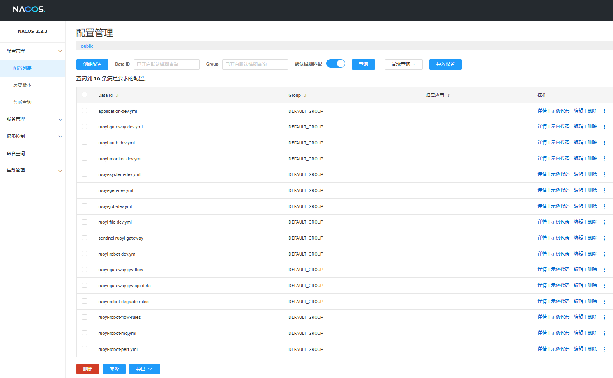

# 配置中心 Nacos

> 统一注册/配置；多环境分组；敏感参数集中管理（热更新）

[{ .img-90 }](assets/nacos-config.png)

**说明**
- 业务与网关配置集中管理（如 `application-*.yml`、`ruoyi-*-dev.yml`），按 **Group/Namespace** 分环境。
- Sentinel 规则（Flow/Degrade 等）通过 Nacos 下发，**资源名与代码一致**，支持热更新与回滚。
