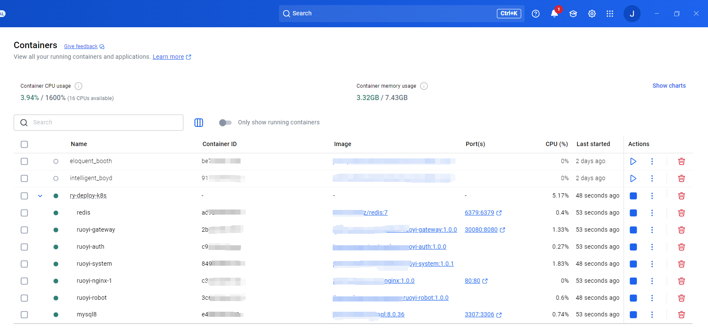
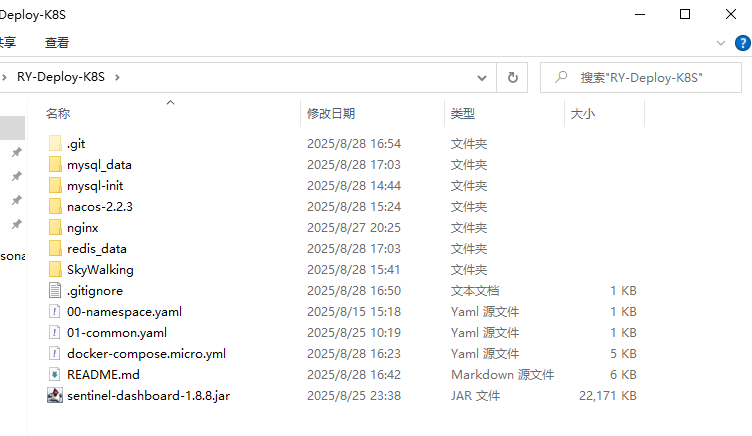
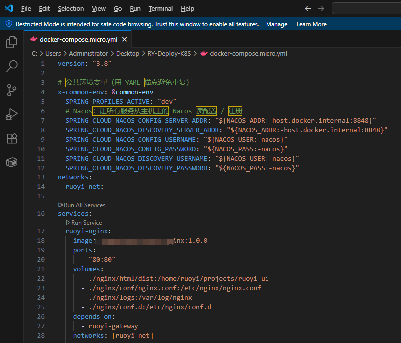
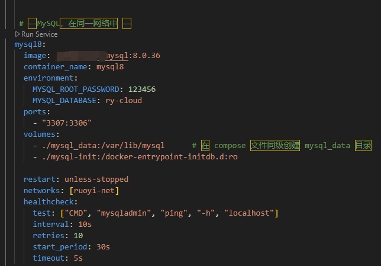
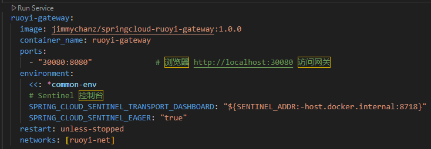

# 容器化部署（Dockerized Deployment）

> 目标：一键拉起/停止；统一网络与配置；本地即可复现“网关 + 业务 + 中间件”的完整运行态。

---

## 1.容器运行态总览

{ width="100%" }

- 运行状态：CPU/内存占用、容器健康度、端口映射一目了然。  
- 服务清单：`mysql`、`redis`、`nacos`、`ruoyi-gateway`、`ruoyi-system`、`ruoyi-robot` …  
- 操作：支持单个/批量 Start/Stop/Restart，便于联调与演示。

---

## 2.目录结构与 Compose

{ width="100%" }
{ width="100%" }
{ width="100%" }
{ width="100%" }

**目录结构（示例）**
- `docker-compose.micro.yml`：一键拉起网关/业务/中间件
- `nacos_*`、`mysql_*`、`redis_data/`：持久化与初始化脚本
- `SkyWalking/`：可观测性（可选）
- `01-common.yaml`：公共环境变量（端口、数据库密码等）

**Compose 关键点（约定统一、可复制）**
- 统一网络：`networks: [ruoyi-net]`，容器内以服务名互通
- 健康检查：为 `mysql`、`nacos` 等增加 `healthcheck`，确保依赖顺序
- `depends_on` + `condition: service_healthy`：先后顺序可靠
- 映射端口：如 `ruoyi-gateway: 30080:8080`、`mysql: 3307:3306`
- 环境变量集中：公共项放 `x-common-env`（或单独 `01-common.yaml`）

> 一句话：把“人要记住的”变成“配置写住的”，本机/同事/演示机都能秒起。

