# 运行效果（Live Demo）

> 所有图片均已做脱敏处理；密钥等敏感信息不对外展示。

## 0 · 首页（Dashboard）
[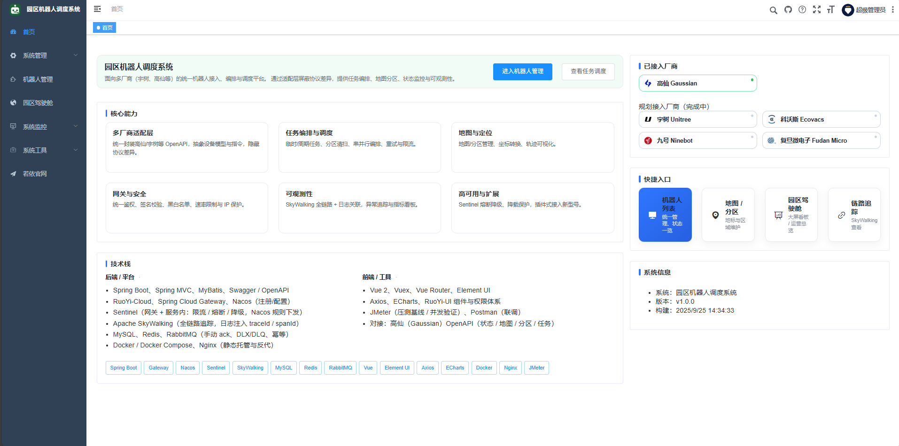{ .img-90 }](assets/live/p10-dashboard.png)
---

## 1 · 机器人管理（Robot Management）
[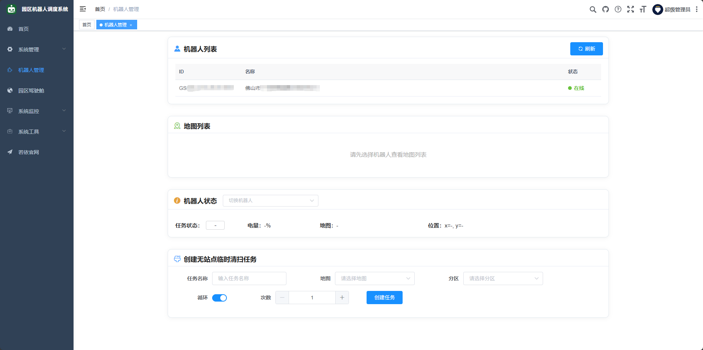{ .img-90 }](assets/live/p11-robot-management.png)
---

## 2 · 点击机器人列表（Click on the robot list）
[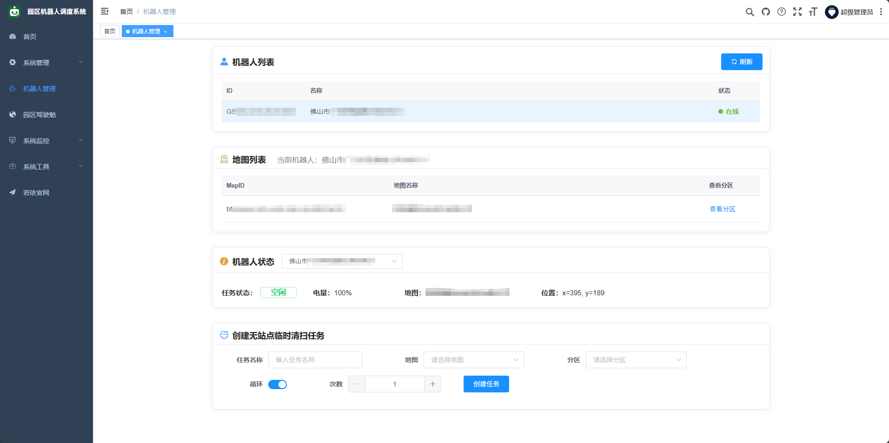{ .img-90 }](assets/live/p12-click-robot-list.png)
---

## 3 · 创建机器人任务（Creating the Robot Task）
[{ .img-90 }](assets/live/p13-create-task.png)
---

## 4 · 机器人任务状态查询（Robot task status query）
[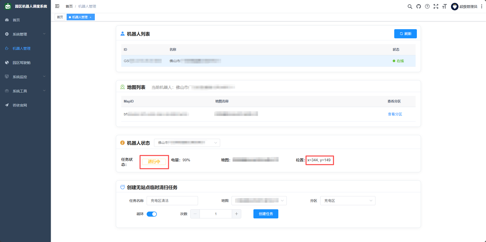{ .img-90 }](assets/live/p14-task-status.png)
---

## 5 · 现场联调：Gaussian 机器人 OpenAPI
> 备注：照片与界面已脱敏；所有密钥已移除，仅展示联调流程与结果。

| &nbsp; | &nbsp; |
|---|---|
| 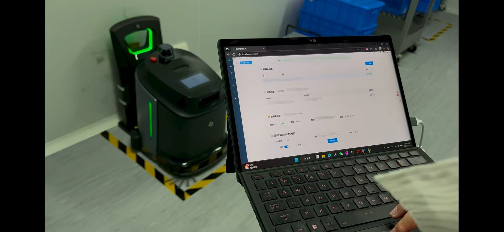 | 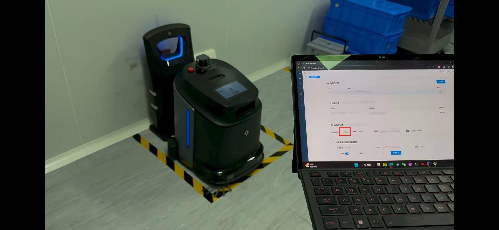 |
| 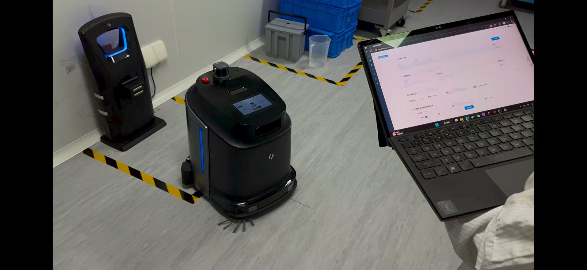 | 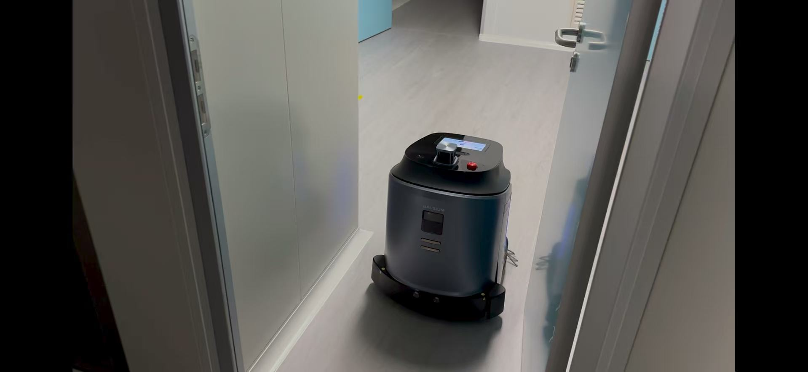 |

---

## 6 · 园区驾驶舱（Park Operations Cockpit）
> 备注：**当前为演示数据**；待与园区系统联调完成后，将切换为**实时数据**展示。
[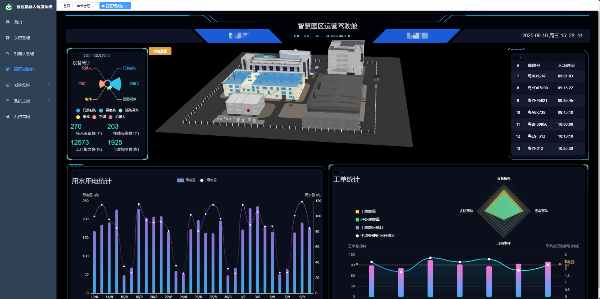{ .img-90 }](assets/live/p16-park-cockpit.png)
---

## 7 · 园区驾驶舱 · 3D 效果展示（Park Operations Cockpit · 3D）
> 备注：**当前为演示数据**；待与园区系统联调完成后，将切换为**实时数据**展示。
[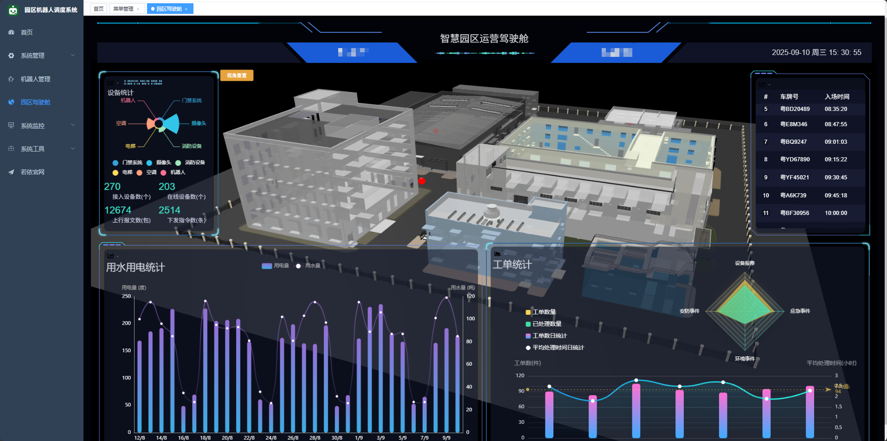{ .img-90 }](assets/live/p17-park-cockpit-3d.png)

## 8 · 园区驾驶舱 · 发现险情（Park Operations Cockpit · Incident Detection）
> 说明：当前为**演示数据**；待与园区系统联调完成后，将切换为**实时数据**展示。

[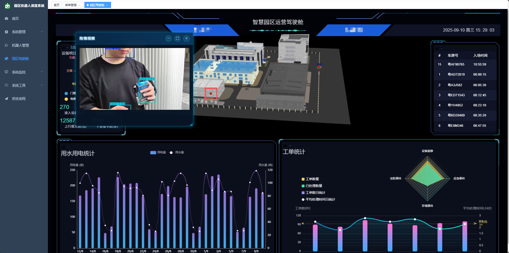{ .img-90 }](assets/live/p18-park-cockpit-incident.png)

