# 压测 JMeter

> 目标：验证入口链路在目标吞吐下的稳定性与可观测性；采用 **Dry-Run** 与 **禁用消费者** 的方式确保不打真机；通过 **RabbitMQ** 与 **SkyWalking** 指标进行侧证。

---

## 1.测试目标与链路范围

[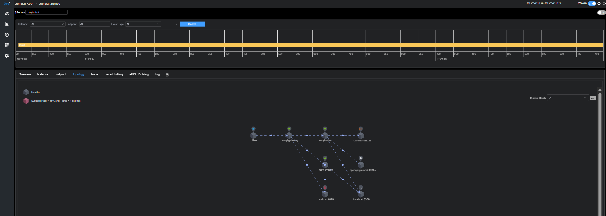{ .img-90 }](assets/loadtest/p01-scope-topology.png)

- 链路：**Gateway → ruoyi-robot → MQ**
- 风险控制：  
  - **Dry-Run**：所有请求带 `X-Dry-Run: true`，网关统一 403 拦截真分支。  
  - **禁用消费者**：下游消费者进程/线程数 = 0，仅验证入口写入与链路吞吐。  
  - **外设隔离**：任务为模拟空实现，不触发真实设备动作。

---

## 2.流量模型与压测方法

[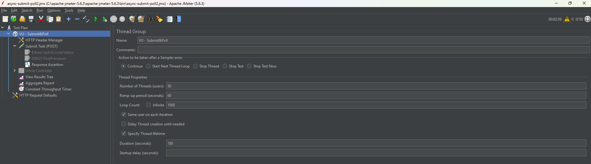{ .img-90 }](assets/loadtest/p02-plan-thread-group.png)  
[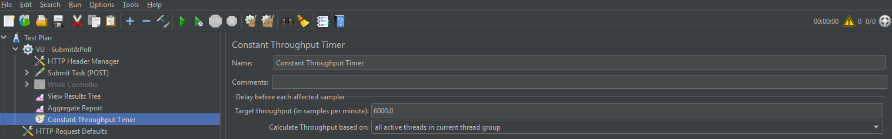{ .img-90 }](assets/loadtest/p02-plan-ct.png)

- 目标吞吐 **100 QPS**，持续 **3 分钟**；`Constant Throughput Timer` 控制全局速率。  
- 断言/后置：保留必要字段（请求头、traceId 注入、响应码等）。

---

## 3.结果总览

[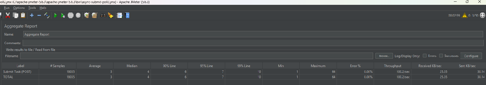{ .img-90 }](assets/loadtest/p03-agg-1.png)  
[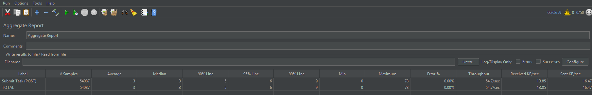{ .img-90 }](assets/loadtest/p03-agg-2.png)  
[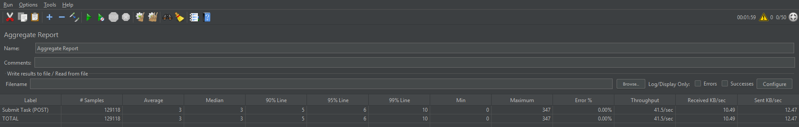{ .img-90 }](assets/loadtest/p03-agg-3.png)

- 错误率 0%，TP 稳定；P95/P99 延迟在预期内。

---

## 4.结果明细

[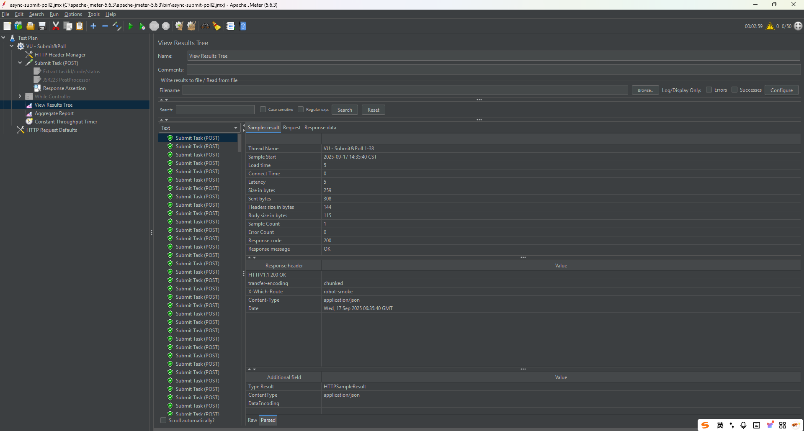{ .img-90 }](assets/loadtest/p04-view-results.png)

- 响应 `200 OK`；`X-Which-Route`、`traceId` 等关键头/标签齐全，便于 **Trace ↔ Log** 互查。

---

## 5.消息侧验证

[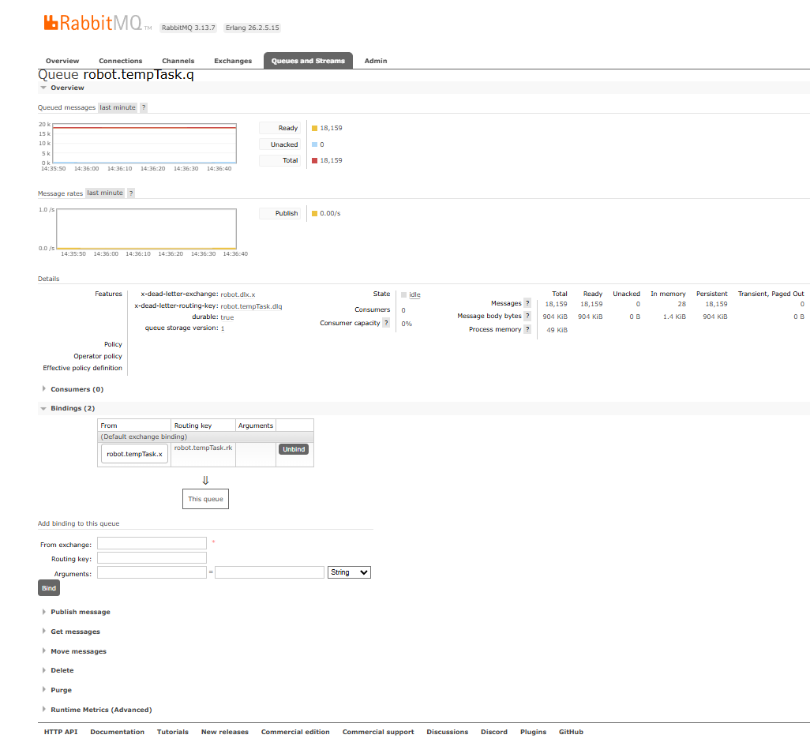{ .img-90 }](assets/loadtest/p05-mq-verify-a.png)  
[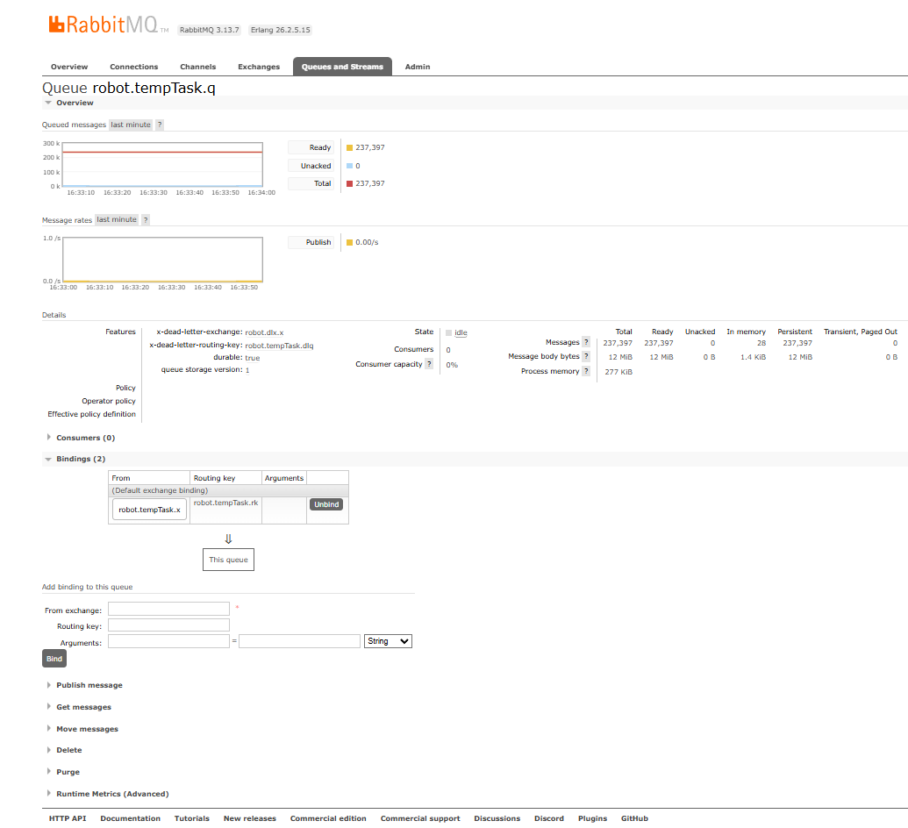{ .img-90 }](assets/loadtest/p05-mq-verify-b.png)

- 队列：`robot.tempTask.q`（示例）；请求入队可见、无消费（消费者禁用），DLX/DLQ 规则正常。

---

## 6.网关服务指标

[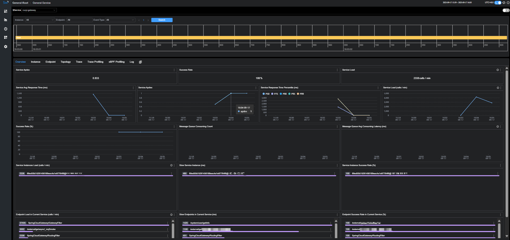{ .img-90 }](assets/loadtest/p06-gateway-metrics.png)

- Apdex、成功率、服务负载、实例负载、端点负载等指标在 100 QPS 下稳定，无异常峰值。

---

## 7.业务服务指标

[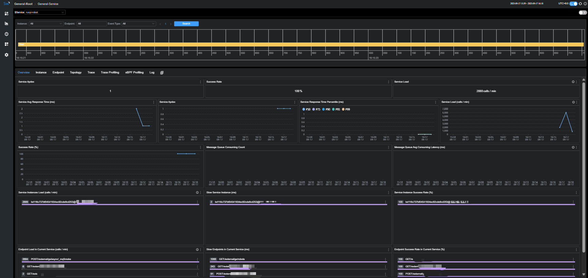{ .img-90 }](assets/loadtest/p07-robot-metrics.png)

- 服务层：平均响应、P95/P99、成功率稳定；实例层：负载分布均衡，无明显倾斜。

---

## 8.端点负载与延迟 
[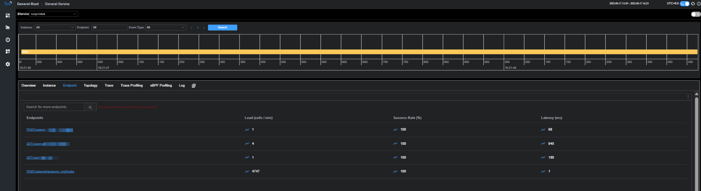{ .img-90 }](assets/loadtest/p08-overview.png)
[{ .img-90 }](assets/loadtest/p08-endpoints.png)

- TopN 端点负载/延迟可视化；定位思路：锁定慢/错端点 → 关联 Trace → 反查日志（traceId）。
