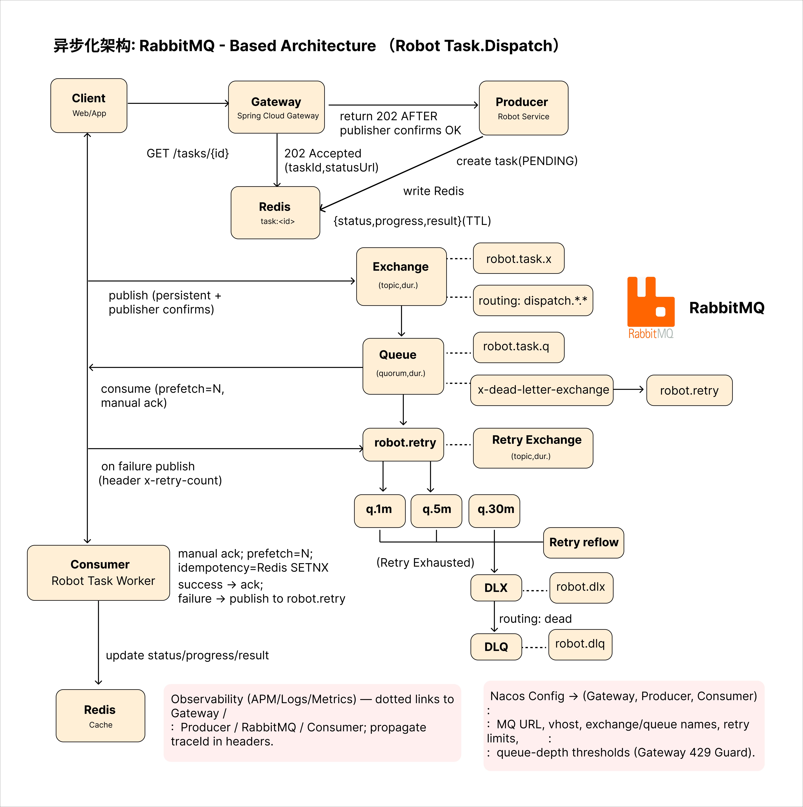
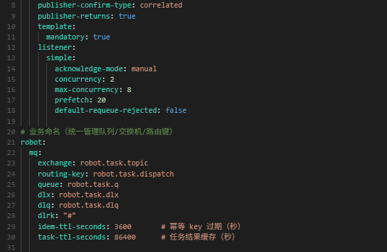
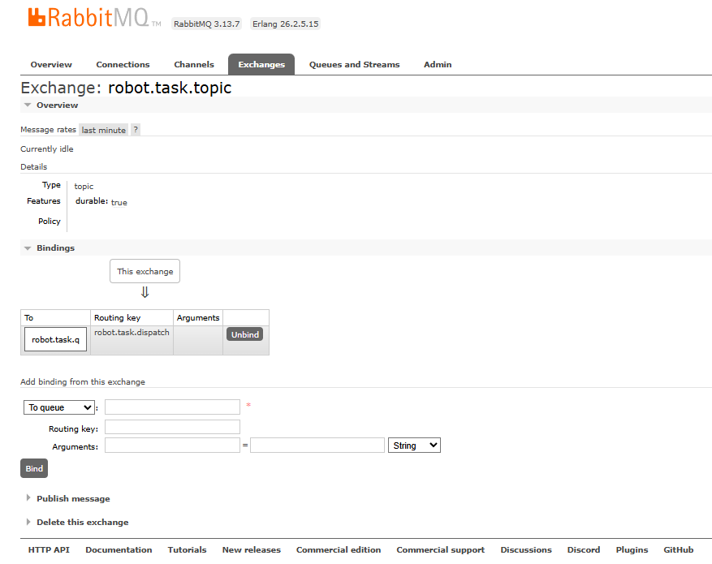
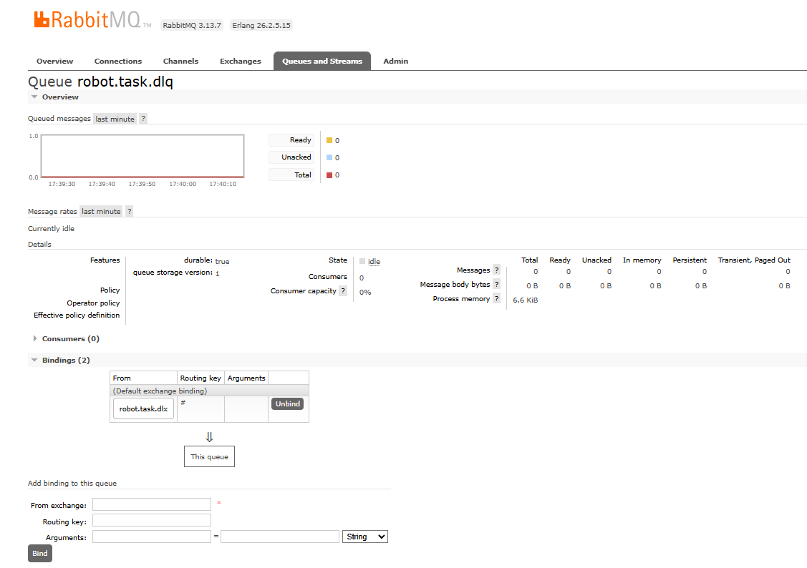
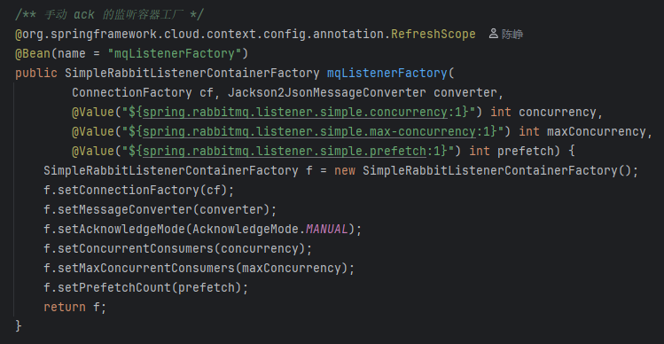
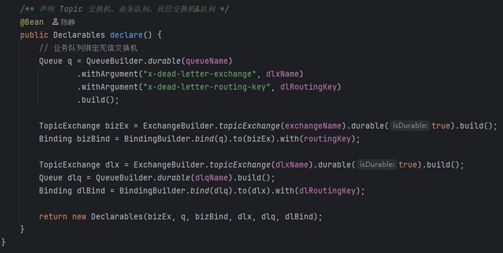
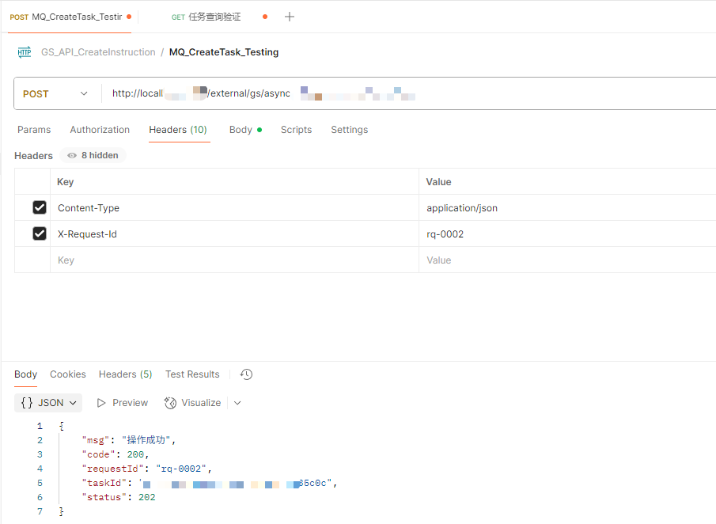
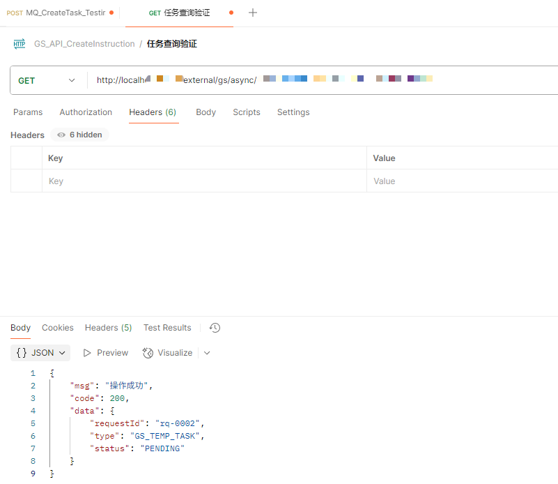

# 异步化 RabbitMQ

> 目标：通过消息化解耦请求与执行，**异步下发任务**；  
> - 客户端下发 → 网关 → Producer 落库与投递（publisher confirm）→ 立即返回 **202** 与任务查询地址；  
> - Consumer **手动 ack**、幂等保证（Redis SETNX）；失败进入 **retry**（q.1m/q.5m/q.30m）用尽后流向 **DLQ**；  
> - 所有环节注入 `traceId`，打通 **APM/Log/Metrics**。

---

## 1.队列监控 & 异步化架构

### 1.1 队列监控（Queue）

- 关注：**ready / unacked / total**、绑定关系（routing key / exchange）、DLX/DLQ 配置等。
- 网关侧可设**队列深度阈值**做 **429 Guard**（保护入口）。

### 1.2 异步化架构（Architecture）

- Producer：**publisher confirms** 成功后返回 202；写 Redis 记录 `status/progress/result`（附 TTL）。  
- Exchange/Queue：topic 交换机；**robot.task.q** 工作队列，**robot.retry** 多级重试，最终流向 **DLQ**。  
- Consumer：`prefetch = N`、**manual ack**；成功 `ack`，失败 publish 到 `robot.retry`。

---

## 2.接入设计与关键参数

[{ .img-90 }](assets/rabbitmq-params-code.png)
[{ .img-90 }](assets/rabbitmq-exchange.png)

- `publisher-confirm-type: correlated` & `publisher-returns: true`，`mandatory: true` 保障 **return 可见**；  
- **并发**：`concurrency=2`、`max-concurrency=8`，**prefetch=20**（总 in-flight≈40）；  
- **TTL**：`message-ttl=3600s`；**任务结果 TTL** 可 24h；  
- **异常不重回**：`default-requeue-rejected: false`，避免“鬼畜”重试。

---

## 3.消费与错误处理

[{ .img-90 }](assets/rabbitmq-dlq.png)
[{ .img-90 }](assets/rabbitmq-consumer-config.png)
[{ .img-90 }](assets/rabbitmq-declare-code.png)

- **失败处理**：先路由到 `robot.retry`（q.1m → q.5m → q.30m），重试用尽 → `robot.task.dlq`；  
- **幂等**：Redis `SETNX`（taskId）确保 Consumer 端**一次且仅一次**的业务执行；  
- **可观测性**：打通链路，`traceId` 贯穿 **网关 / Producer / RabbitMQ / Consumer**，排障快。

---

## 4.联调结果（Postman）

[{ .img-90 }](assets/rabbitmq-postman-create.png)
[{ .img-90 }](assets/rabbitmq-postman-status.png)

- **创建任务**：返回 `202 Accepted` + `statusUrl`；  
- **查询任务**：按 `taskId` 查 Redis（或 DB），返回 **PENDING / RUNNING / SUCCESS / FAIL**；  
- Header 注入 **X-Request-Id** 便于与日志/Trace 对齐。
