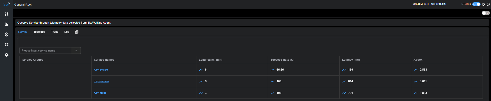
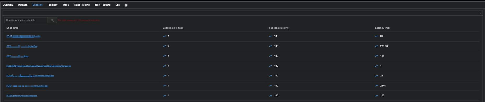
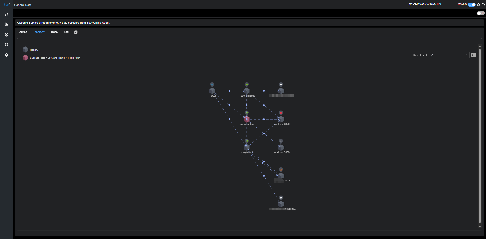
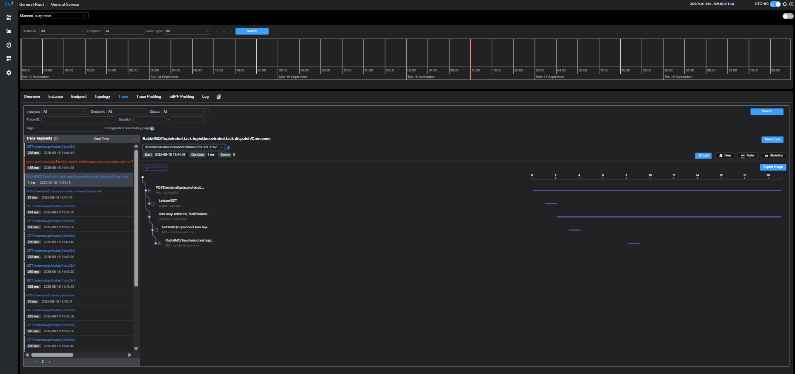
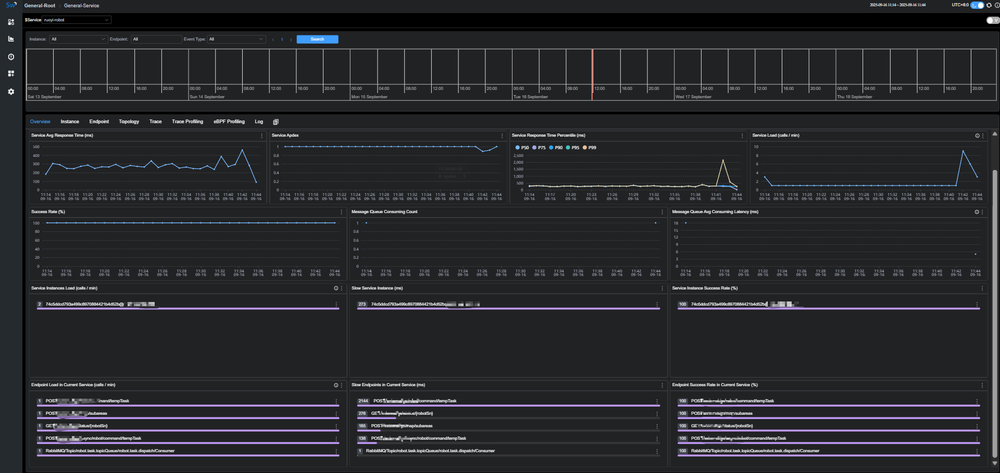

# 可观测性（SkyWalking）

> 目标：端到端 tracing；Gateway→下游可串；`traceId` 注入日志，实现 **trace ↔ log** 互查。  
> 仪表：Service / Endpoint 指标（QPS、Latency、Error）、拓扑、Trace 详情、Dashboard。

---

## 1) 端到端观测总览（Services & Endpoints）
[{ .img-90 }](assets/sw-overview-services.png)
[{ .img-90 }](assets/sw-overview-endpoints.png)

- **Service 概览**：各服务的吞吐、成功率、延迟、Apdex。  
- **Endpoint 视图**：当前服务内 TopN 接口的调用量与成功率，用于定位慢/错接口。

---

## 2) 服务拓扑（Service Topology）
[{ .img-90 }](assets/sw-topology.png)

- 直观看到 **Gateway → 各服务 → DB/Cache/Vendor** 的调用关系；  
- 实线/虚线区分真实调用与遥测上报；支持设置拓扑深度、筛选失败流向。

---

## 3) 链路追踪：异步任务路径（Trace View）
[{ .img-90 }](assets/sw-trace.png)

- 展示从 **入队 → 消费 → 外部 OpenAPI → 持久化** 的完整 Span；  
- 常用操作：根据 **`traceId`** 从日志跳回 Trace；对单个 Span 查看 Tags/Logs/Stack。

---

## 4) 服务概览看板：关键指标（Overview Dashboard）
[{ .img-90 }](assets/sw-dashboard.png)

- 关键指标：**平均/分位延迟（p50/p95/p99）**、**QPS/错误率**、**各实例负载**；  
- 辅助图：慢接口排行、消息队列消费延迟、实例成功率等，支持时间窗口切换。
