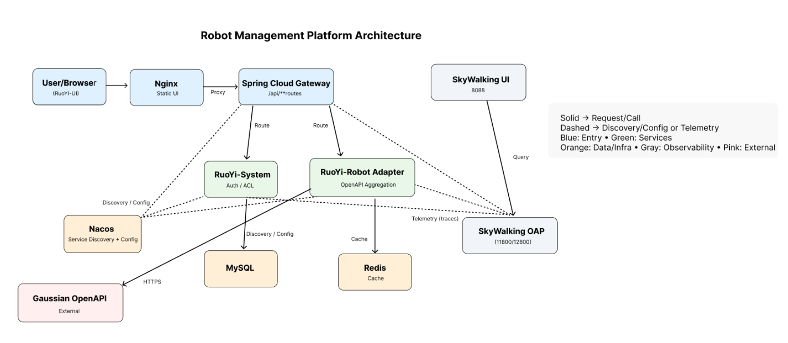
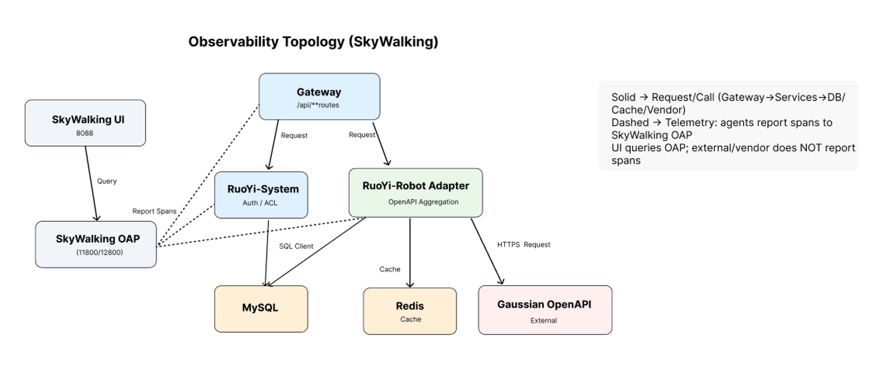

# 架构总览（Architecture Overview）

> 形态：RuoYi-Cloud 微服务（Gateway + 业务服务），Nacos 做注册/配置，RabbitMQ（见异步化页）、MySQL/Redis 做数据与缓存，SkyWalking 做可观测闭环，Nginx 托静态前端。

## 1) 系统架构图

**关系说明**
- **入口**：`User/Browser → Nginx → Spring Cloud Gateway`（`/api/**` 路由）
- **业务**：`RuoYi-System`（鉴权/ACL）与 `RuoYi-Robot Adapter`（OpenAPI 聚合）
- **注册/配置**：服务通过 **Nacos** 发现与拉取配置（多环境）
- **数据层**：`MySQL`（业务数据）与 `Redis`（缓存/幂等/短期结果）
- **外部**：`Gaussian OpenAPI` 通过 HTTPS 调用
- **可观测性**：各实例向 **SkyWalking OAP** 上报 Trace；**SkyWalking UI** 仅做查询
- **连线含义**：**实线 = 请求/调用**；**虚线 = 发现/配置/遥测**

---

## 2) 可观测性拓扑（SkyWalking）

**观测口径**
- **实线**：真实调用链（Gateway → Services → DB/Cache/Vendor）
- **虚线**：Agent 将 Span 上报到 **OAP**；UI 只向 OAP 发查询，不直接连业务
- **落点**：在网关与服务两侧均可看到 **Service / Endpoint** 指标与 Trace

**常用看板**
- 吞吐/QPS、延迟（p50/p95）、错误率
- 慢调用占比与 TopN Endpoint
- Trace 关联日志（`traceId` 注入）

---

### 相关页面
- [What / Why](02-what-why.md)
- [单体 → 微服务](03-monolith-to-microservices.md)
- [OpenAPI 封装与稳定性](07-openapi-stability.md)
- [异步化（RabbitMQ）](../mq-async.md)
- [可观测性（SkyWalking）细节](../observability.md)
