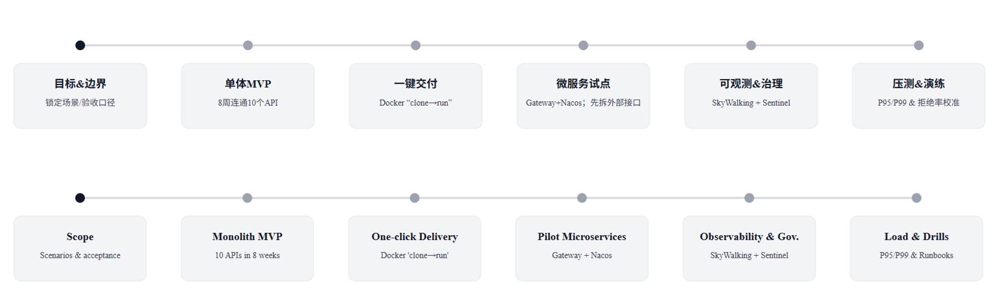

# 项目阶段 / 演进路线 & 里程碑（Project Phases & Milestones）

## 1) 项目阶段 / 演进路线（Project Phases & Evolution Path）
<!-- 你只需把下图保存为 docs/assets/05-phases.png 或者改成你的文件名 -->

> 路径参考（可选说明）：单体 MVP → Docker “clone→run” → 微服务试点（Gateway + Nacos） → 观测/治理（SkyWalking + Sentinel）。

---

## 2) 里程碑 & 可量化产出（Milestones & Quantifiable Outputs）

| 阶段             | 关键产出                                                                 | 指标/信号                                                                 |
|------------------|--------------------------------------------------------------------------|--------------------------------------------------------------------------|
| 单体 MVP         | 10 个 OpenAPI 联调；核心路径打通                                         | 联测一次通过；核心路径成功率 ≥ **99.2%**                                 |
| 一键交付         | Compose + 数据卷 + 首启 SQL；标准化镜像/脚本                              | 新环境就绪 ≤ **12 分钟**；同仓部署成功率 **6/6**                         |
| 微服务试点       | Gateway + Nacos；先拆外部接口聚合/任务下发；回滚策略                      | 目标模块**独立发布**；回滚 ≤ **5 分钟**；发布窗口 **↓50%**              |
| 可观测/治理      | SkyWalking 端到端追踪；Sentinel 限流/熔断；统一异常/超时/连接池            | **trace→log 覆盖 ≥95%**；**定位时长 12→3 分钟**；高峰**拒绝率 ≤1.5%**   |
| 压测/演练        | 阈值表 & Runbook；容量/故障演练                                           | 峰值 **QPS ≥120（staging）**；**P99 ≤900ms**；**错误率 ≤1%**；演练**3/3**  |

> 说明：上表为可检索文本；下方图片为 PPT 快照备份。
