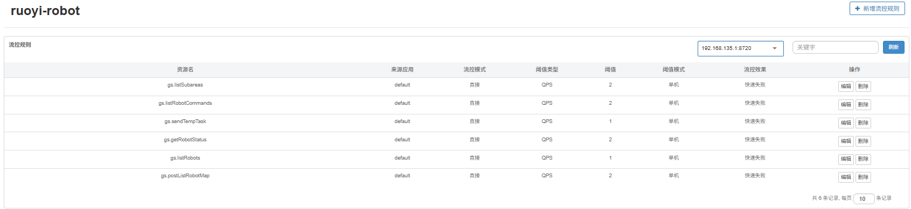
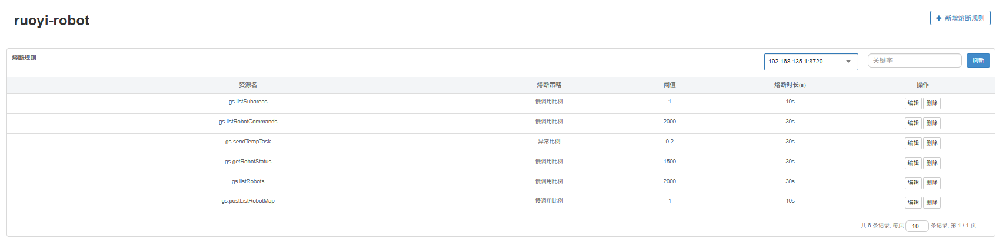
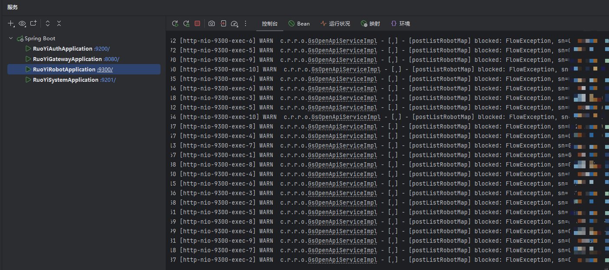
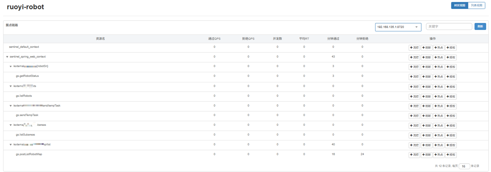
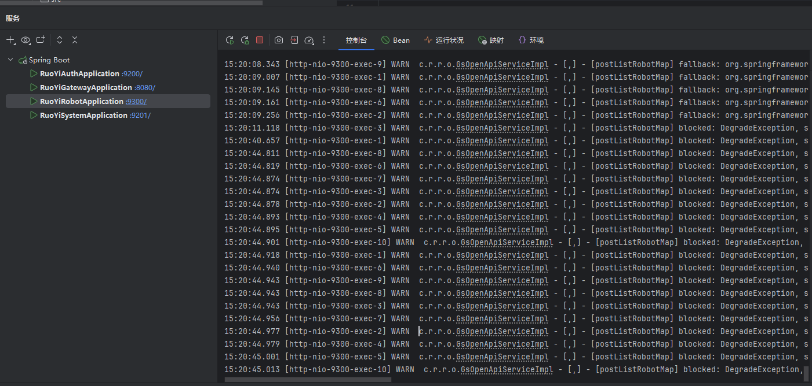
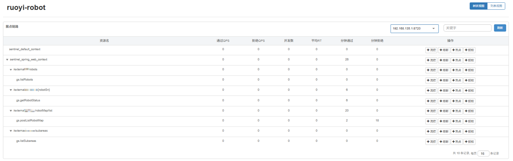

# 稳定性（Sentinel）

> 目标：**限流（Flow limiting）**、**熔断/降级（Circuit breaking/Degrade）**；  
> 策略集中托管，经由 Nacos 下发；读接口短 TTL 缓存，写接口快速失败（429/503），避免级联。

---

## 1) 规则集中治理（Flow & Degrade Rules）

[{ .img-90 }](assets/sentinel-rules-flow.png)
[{ .img-90 }](assets/sentinel-rules-degrade.png)

- 规则来源：Nacos 配置中心统一下发，**资源名与代码一致**，便于排查与回滚。  
- 建议：读接口设置短 TTL 的缓存兜底；写接口设置**快速失败**阈值，缩短恢复时间。

---

## 2) 限流触发日志（Rate limiting）

[{ .img-90 }](assets/sentinel-rate-limit-logs.png)

- 触发 `FlowException` 时打印明确的 blocked 记录，包含 **资源名 / 触发来源** 等信息。  
- 网关/核心服务可根据资源名做不同 fallback。

---

## 3) 限流测试结果（Rate limiting Result）

[{ .img-90 }](assets/sentinel-rate-limit-result.png)

- 观察通过/拒绝 QPS、并发数、平均 RT、分钟通过/拒绝等指标；  
- 验证压测方式、触发阈值是否符合预期（**不拖垮主流程**）。

---

## 4) 熔断/降级触发日志（Degrade logs）

[{ .img-90 }](assets/sentinel-degrade-logs.png)

- 触发 `DegradeException` 或执行 fallback 时记录降级原因，快速定位异常来源。  
- 建议：回滚/重试路径与主流程隔离，避免雪崩效应。

---

## 5) 熔断测试结果（Circuit breaking Result）

[{ .img-90 }](assets/sentinel-degrade-result.png)

- 对关键资源观察降级次数/时长、平均 RT 与成功率，确认“**不扩散、不放大**”。  

---

## 6) 代码示例片段（Code examples）

  
  
  
  

- 约定：**接口对接/任务下发类**的 Fallback/BlockHandler 聚合在 **Service 层**（Controller 变薄）；  
- 资源名统一规范（与规则一致），日志注入 `traceId`，实现 **trace ↔ log** 互查。

